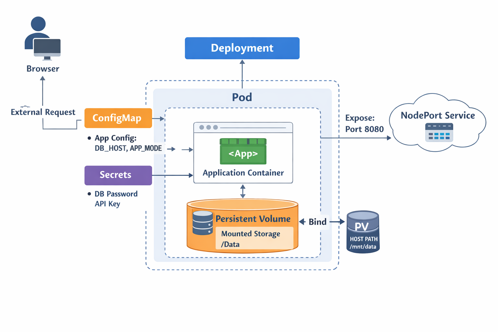

# 🟢 Day 14 — Mini Project 2 (Full Kubernetes Application)

This project is part of the **Kubernetes 30 Days Learning Challenge** and represents
a **real-world Kubernetes application architecture** using multiple core resources.

The goal of this mini project is to demonstrate how different Kubernetes components
work together in a production-like setup.

---

## 🚀 Technologies & Resources Used

- Deployment
- ConfigMap
- Secret
- Persistent Volume (PV)
- Persistent Volume Claim (PVC)
- NodePort Service

---

## 🧱 Architecture Overview


---
## 📂 Project Structure
```
full-app/
├── namespace.yaml
├── configmap.yaml
├── secret.yaml
├── pv.yaml
├── pvc.yaml
├── deployment.yaml
├── service.yaml
└── README.md

```
---
## ⚙️ How to Deploy
### Step 1: Create Namespace
```
kubectl apply -f namespace.yaml
```
### Step 2: Create Storage
```
kubectl apply -f pv.yaml
kubectl apply -f pvc.yaml
```
### Step 3: Create Config & Secrets
```
kubectl apply -f configmap.yaml
kubectl apply -f secret.yaml
```
### Step 4: Deploy Application
```
kubectl apply -f deployment.yaml
kubectl apply -f service.yaml
```
---
## 🔍 Verify
```
kubectl get all -n demo-app
kubectl get pv
kubectl get pvc -n demo-app
```
Access the application:
```
http://<NODE-IP>:30080
```
---
## ✅ Key Learnings

- How to design a real Kubernetes application

- Separation of configuration and secrets

- Persistent data handling using PV & PVC

- Exposing applications using NodePort

- Production-style Kubernetes manifests