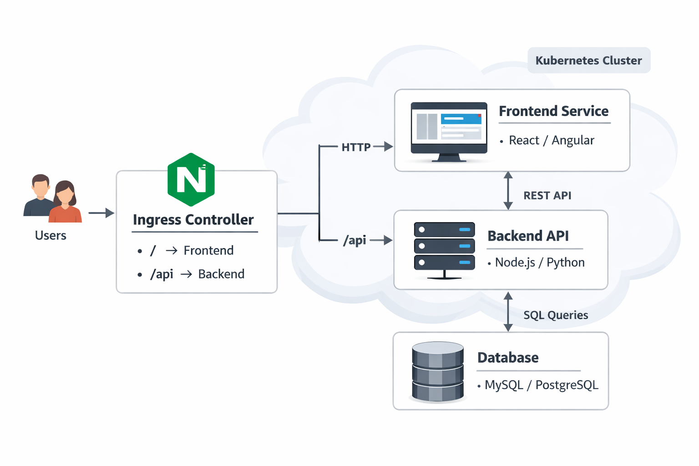

# Day 21 — Mini Project 3: Kubernetes Microservice Application

This project demonstrates a multi-service microservice architecture
deployed on Kubernetes with Ingress-based routing.

---

## 📌 Architecture Overview



This architecture represents a web application deployed inside a Kubernetes cluster,
where an Ingress Controller is used to route external traffic to internal services.

---

## 🧩 Key Components

### 1. Users
- End users access the application via a browser.
- All requests enter the system through a single entry point (Ingress).

---

### 2. Ingress Controller (NGINX)
- Acts as the gateway to the Kubernetes cluster.
- Handles external HTTP/HTTPS traffic.
- Routes requests based on URL paths:
  - `/` → Frontend Service
  - `/api` → Backend API

**Why Ingress?**
- Centralized routing
- Cleaner URLs
- Better traffic management

---

### 3. Frontend Service
- Built using modern frontend frameworks (React / Angular).
- Responsible for UI rendering.
- Communicates with the backend using REST APIs.

**Responsibilities:**
- User interface
- API request initiation
- Client-side logic

---

### 4. Backend API
- Implemented using Node.js or Python.
- Exposes RESTful APIs.
- Handles business logic and data processing.

**Responsibilities:**
- API endpoints
- Authentication & validation
- Communication with the database

---

### 5. Database
- Relational database (MySQL / PostgreSQL).
- Stores persistent application data.
- Accessible only by the backend service.

**Why separate database access?**
- Better security
- Clear separation of concerns

---

## 🔄 Request Flow (Step-by-Step)

1. User sends an HTTP request from the browser
2. Request reaches the Ingress Controller
3. Ingress routes:
   - `/` requests → Frontend Service
   - `/api` requests → Backend API
4. Backend API processes the request
5. Backend communicates with the database using SQL queries
6. Response flows back to the user through the same path

---

## 🧠 What This Architecture Demonstrates

- Understanding of microservice-based design
- Kubernetes-native traffic routing using Ingress
- Frontend and backend separation
- Secure backend-to-database communication
- Real-world cloud application thinking

---

## 🎯 Learning Goals

- Visualizing service-to-service communication
- Understanding ingress-based routing
- Designing scalable and maintainable systems
- Explaining architecture clearly in interviews

---

## 🚀 Deployment

```
kubectl apply -f frontend/
kubectl apply -f backend/
kubectl apply -f database/
kubectl apply -f ingress/
```
---

## 🔍 Verify
```
kubectl get pods
kubectl get svc
kubectl get ingress
```
---

## 👤 Author
**Nahid**  
DevOps Learner | Cloud & Kubernetes Enthusiast

